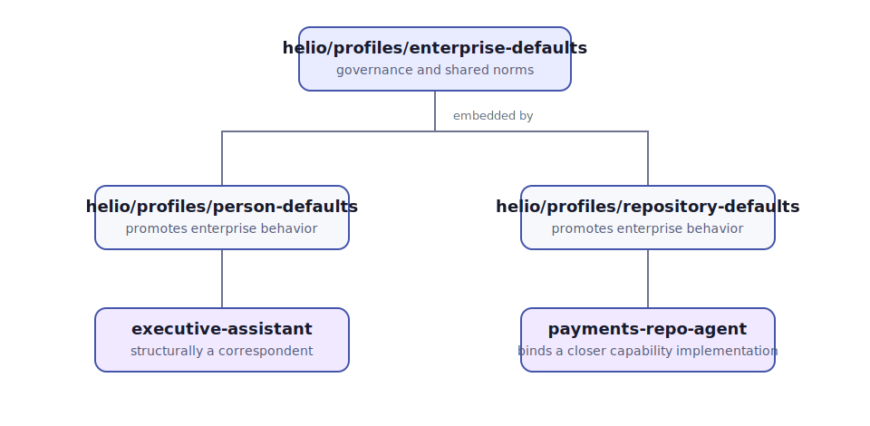
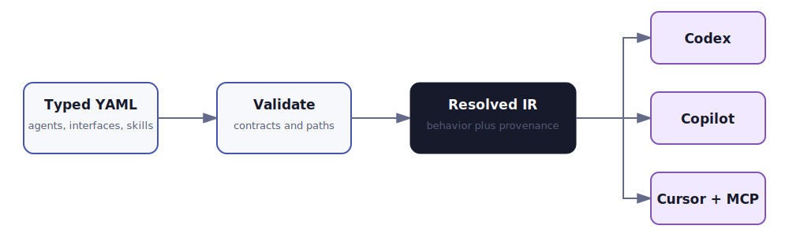
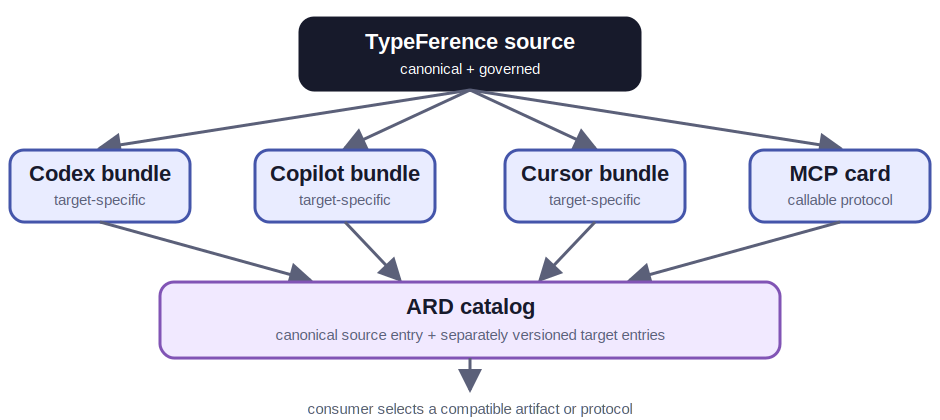
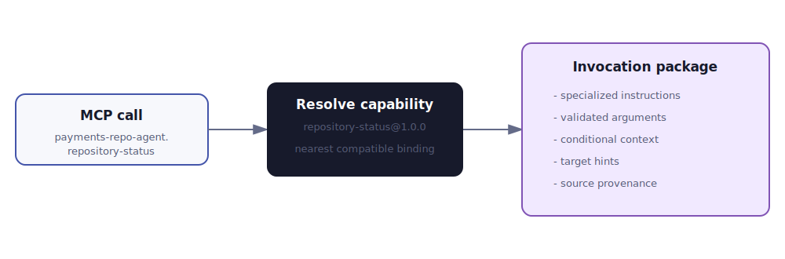
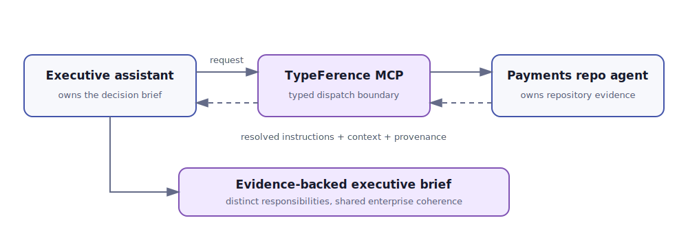

# TypeFerence

## A typed coherence layer for portable organizational agents

TypeFerence contributors - July 2026

### Abstract

Organizations are teaching AI assistants the same business rules repeatedly: once for a coding agent, again for an executive assistant, again for each repository, and again for every vendor-specific Markdown format. The result is semantic drift hidden inside apparently simple files.

TypeFerence treats agent definitions as typed source code. Organizations define reusable agents, structurally satisfied interfaces, and versioned skills, then combine behavior through Go-like embedding. A deterministic compiler resolves those definitions and emits native artifacts for Codex, GitHub Copilot, Cursor, neutral Agent Markdown, and MCP. The central result is not merely portability. It is coherent reuse of domain decisions across people, repositories, tools, and time. Behavioral equivalence across hosts is the long-term objective; v2 supplies a typed baseline from which equivalence can be evaluated rather than claiming it has already been achieved.

## 1. The coherence problem

Markdown is an excellent runtime format and a poor organization-wide type system. As agent adoption grows, similar instructions appear in many places. Security language diverges. Status-reporting methods acquire incompatible meanings. A policy correction must be rediscovered and edited in dozens of files. Reviewers can see textual differences but cannot reliably identify which behavior was embedded, replaced, or accidentally omitted.

The underlying problem is repeated domain modeling. Each local agent solves identity, capability, context selection, and governance again. Vendor portability is one visible symptom; duplicated organizational reasoning is the larger cost.

TypeFerence introduces a canonical typed layer above runtime Markdown. Source definitions are small. Skills conditionally reference context. Compilation is deterministic. The generated artifacts remain ordinary files that existing tools understand.

## 2. Composition over ancestry

TypeFerence has no universal root. Organizations can define a reusable enterprise agent as the home for organization-wide norms and governance, then embed it wherever those behaviors belong. Agents with unrelated responsibilities do not need to pretend they share an ancestor.

An embedding agent promotes the slots, norms, context, and skill contracts of its embedded agents. It can embed more than one reusable component. Local declarations resolve promoted-name conflicts explicitly, so composition never depends on a hidden linearization order.

This separation matters. The framework owns composition mechanics while organizations own behavior. Nothing is inherited merely because every resource is forced beneath the same root.

## 3. A sustainable object model

Agents may embed multiple agents. Interfaces state required slots and skill contracts but contribute no implementation, and interfaces may themselves embed narrower interfaces. Agents satisfy them implicitly when their resolved member sets match—there is no nominal `implements` list to drift out of sync.

Skills behave like versioned methods. A repository agent may provide `repository-status`. A payments repository agent can bind a specialized implementation to that promoted contract while preserving the same JSON input and output schemas. Callers use the outer namespace and receive its explicitly selected implementation.

This is structural substitutability rather than text concatenation. An interface can require a status capability without knowing which concrete repository agent will satisfy it. Compilation reports structural matches, rejects ambiguous promotion, and rejects contract-breaking implementations before runtime. Whether two model executions behave equivalently remains an empirical question for evaluation, not a compiler guarantee.

## 4. Compilation and native targets

The compiler parses resources, validates references, resolves embedding graphs, computes structural interface satisfaction, canonicalizes skill contracts, and creates a normalized intermediate representation. Target adapters then emit platform-native artifacts.

The neutral output includes resolved instructions, bundles, skill packages, and provenance. Codex receives `AGENTS.md`, open skill folders, and MCP configuration. Copilot receives repository instructions and agent profiles. Cursor receives `AGENTS.md` and project rules. Adapters may use native capabilities without forcing every platform into a lowest-common-denominator file, and must surface diagnostics when a target cannot represent a portable field.

Stable sorting, normalized paths, LF newlines, canonical JSON, and the absence of timestamps make builds byte-for-byte reproducible. A source change therefore yields a reviewable artifact diff.

## 5. Definition portability is not discovery

The Agentic Resource Discovery (ARD) v0.9 proposal defines how deployed agents, skills, MCP servers, A2A agents, APIs, and workflows can be cataloged, found, and verified. Its artifact-agnostic envelope intentionally delegates each resource's internal representation and execution to the resource's native specification.

TypeFerence occupies the preceding layer. It resolves one governed source definition into the native artifacts that runtimes can consume. Those compiled artifacts may then be published through ARD, discovered by clients, and invoked through MCP, A2A, OpenAPI, or host-native mechanisms.

ARD can tell a client that a Copilot agent artifact exists; it does not transform that artifact into Cursor rules. TypeFerence performs the target transformation. Discovery interoperability, definition portability, and behavioral equivalence are separate properties.

The publication unit is therefore a matrix. A publisher may advertise one canonical TypeFerence source package for audit and rebuilding, plus separately versioned Codex, Copilot, Cursor, neutral, MCP, or future target variants. Every compiled entry points back to the canonical source identifier and digest. Consumers normally select a prebuilt artifact for their runtime rather than compiling untrusted source during invocation.

Static host configurations are installable artifacts, not remotely callable agents. An ARD entry can carry or locate the bundle, but a target-aware consumer still has to install it. A deployed MCP or A2A service can instead be advertised using its native server or agent card and invoked through that protocol. The prototype's TypeFerence package media types are experimental until a broader packaging contract exists.

## 6. Skills, context, and dispatch

Large prompts are not required. A skill contains a concise description for discovery, its focused instructions, input/output schemas, and only the context references needed when invoked. The host receives an invocation package and loads that context at execution time.

MCP provides the runtime object boundary. Each concrete method is exposed as `agent-name.skill-name`. Calling `payments-repo-agent.repository-status` resolves the base contract to the payments implementation, validates arguments, and returns instructions, context references, target hints, and provenance.

TypeFerence intentionally does not select a model or execute an agent turn. It compiles and dispatches coherent definitions; the host remains responsible for inference, permissions, and user interaction.

## 7. Agents beyond repositories

Engineering teams are plausible early adopters because their work is already versioned and reviewable, but the model is not repository-specific. The Helio example includes a generic person agent, an executive assistant, a repository agent, and a specialized payments repository agent.

The executive assistant can prepare a decision brief. When repository evidence is material, its skill requests the specialized repository-status method. The repository agent returns an invocation package grounded in its own domain context. The person-facing agent incorporates that evidence without duplicating repository knowledge.

This arrangement preserves distinct responsibilities. The executive assistant owns the shape of the brief. The repository agent owns technical status semantics. The enterprise base owns shared governance. TypeFerence owns how those parts compose.

## 8. Diff as governance

Traditional infrastructure tools made declarative diffs operationally important. TypeFerence applies the useful portion of that idea without coupling compilation to deployment. Its lifecycle is author, validate, resolve, compile, diff, and publish.

A change to an enterprise norm can be compiled across every concrete agent. Reviewers can inspect exactly which target artifacts changed. Provenance answers why a line exists and which embedded agent or skill supplied it. Contract validation prevents an apparently harmless specialization from silently changing what callers may send or expect.

This enables governance through normal software practices: pull requests, deterministic CI, golden artifacts, versioned contracts, and explicit ownership.

## 9. Boundaries and future work

The reference prototype does not manage deployment state, host models, or grant authority. It validates top-level JSON arguments but is not a complete JSON Schema engine. Target adapters demonstrate native shapes and should evolve alongside their platforms.

Promising extensions include native ARD cards for deployed MCP and A2A targets, signed compiled bundles, richer schema validation, semantic diff summaries, policy linting, remote MCP transport, and conformance suites for third-party adapters.

The important boundary should remain: portable mechanics in TypeFerence, behavioral authority in the organization, and execution authority in the host.

## 10. Conclusion

Agent coherence is not achieved by finding one perfect prompt. It is achieved by giving organizational behavior a maintainable type system and compiling that system into the places where work happens.

TypeFerence offers a compact thesis: define agent configuration once, embed intentionally, implement contracts compatibly, load context when needed, and emit native artifacts for each execution surface. The result is less duplicated Markdown, clearer ownership, and reviewable change. The route toward behavioral equivalence is then concrete: declare shared contracts, compile traceable target variants, and evaluate those variants against the same scenarios.

## References

1. OpenAI, Codex customization, Agent Skills, AGENTS.md, and MCP documentation: https://developers.openai.com/codex/
2. GitHub, Copilot customization and custom agents documentation: https://docs.github.com/copilot/
3. Cursor, Project Rules and MCP documentation: https://docs.cursor.com/context/rules
4. Model Context Protocol, tools specification: https://modelcontextprotocol.io/specification/
5. Agentic Resource Discovery specification: https://agenticresourcediscovery.org/spec/
6. AI Catalog standard: https://agenticresourcediscovery.org/ai_catalog_spec/
7. Apache Software Foundation, Apache License 2.0: https://www.apache.org/licenses/LICENSE-2.0
