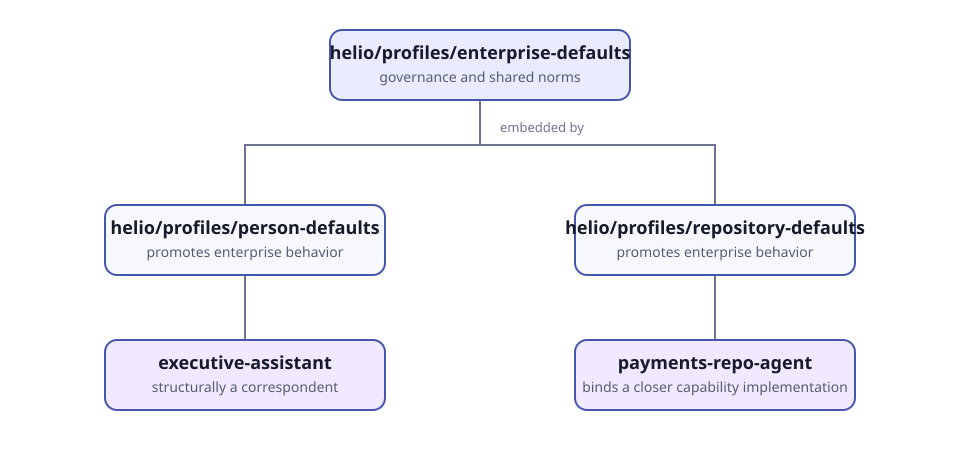
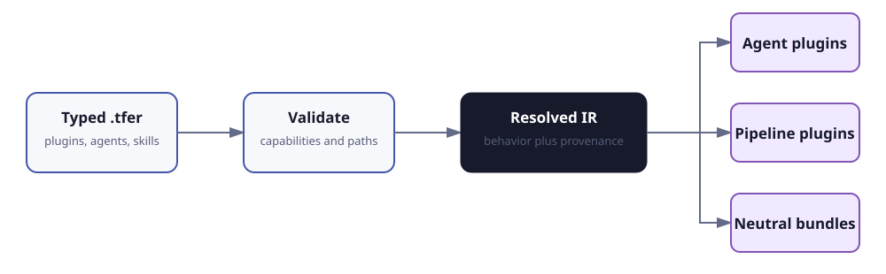
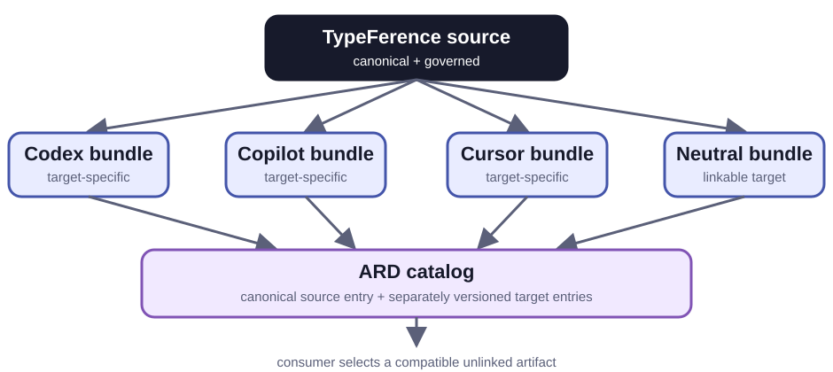
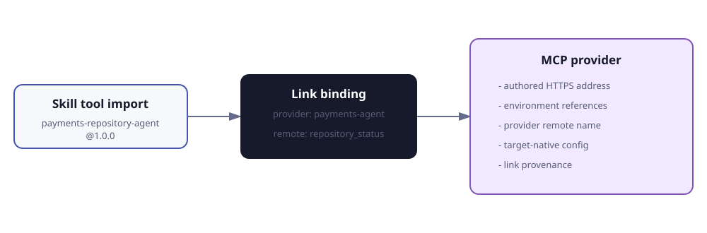
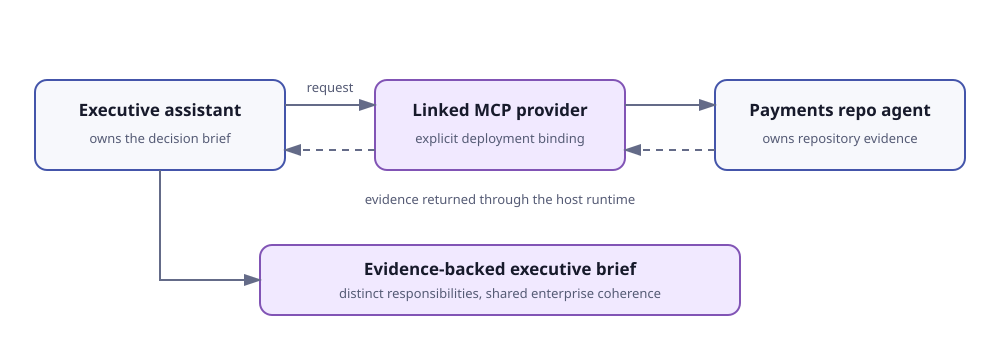

# TypeFerence

## A typed coherence layer for portable organizational agents

TypeFerence contributors - September 2026

### Abstract

Organizations are teaching AI assistants the same business rules repeatedly: once for a coding agent, again for an executive assistant, and again for each repository and team. A well-tuned agent stays in the repository it was written for, and its copies drift. The result is semantic drift hidden inside apparently simple files.

TypeFerence treats agent definitions as typed source code. Organizations define reusable profiles, structurally satisfied interfaces, capabilities, and skills that extend shared skills, then combine behavior through Go-like embedding. Plugin documents state which agents and skills ship together. A deterministic compiler resolves those definitions and emits a marketplace of GitHub Agent Plugins, which people install once and use in every repository and in automated runs, plus a canonical neutral bundle. Runtime MCP/A2A configuration is linked from explicit deployment bindings rather than invented during compilation. The central result is not merely distribution. It is coherent reuse of domain decisions across people, repositories, tools, and time. Behavioral equivalence across the places an agent runs is the long-term objective; version 6 supplies a closed typed baseline from which equivalence can be evaluated rather than claiming it has already been achieved.

## 1. The coherence problem

Markdown is an excellent runtime format and a poor organization-wide type system. As agent adoption grows, similar instructions appear in many places. Security language diverges. Status-reporting methods acquire incompatible meanings. A policy correction must be rediscovered and edited in dozens of files. Reviewers can see textual differences but cannot reliably identify which behavior was embedded, replaced, or accidentally omitted.

This is the answer to "why not just write `AGENTS.md` directly?" Direct instruction files are the right level for small, local customization, but they are not the best level for organization-wide reuse. Agent runtime system prompts are like machine code: they are the concrete behavior stream the model consumes. `AGENTS.md`, custom agent profiles, `SKILL.md` files, and similar files are like assembly language: human-readable and powerful, but still tied to one host's instruction shape. TypeFerence is the higher-level language above them, where teams can express shared concepts once and compile them into the host-native forms.

The underlying problem is repeated domain modeling. Each local agent solves identity, capability, context selection, and governance again. Dozens of near-identical copies of one skill are the visible symptom; duplicated organizational reasoning is the larger cost.

TypeFerence introduces a canonical typed layer above runtime Markdown. Source definitions are small. Context is a first-class typed value, skills declare the context types and runtime tools they require, and compilation is deterministic. The generated artifacts remain ordinary files that existing tools understand.

## 2. Composition over ancestry

TypeFerence has no universal root. Organizations can define reusable profiles as the home for organization-wide norms and governance, then embed them wherever those behaviors belong. Agents with unrelated responsibilities do not need to pretend they share an ancestor.

An embedding agent promotes the slots, context, objectives, and capability bindings of its embedded profiles or agents. It can embed more than one reusable component. Local declarations resolve promoted-name conflicts explicitly, so composition never depends on a hidden linearization order.

This separation matters. The framework owns composition mechanics while organizations own behavior. Nothing is inherited merely because every resource is forced beneath the same root.

## 3. A sustainable object model

Agents may embed multiple profiles or agents. Profiles may embed other profiles. Interfaces state required slots and capabilities but contribute no implementation, and interfaces may themselves embed narrower interfaces. Agents satisfy them implicitly when their resolved member sets match—there is no nominal `implements` list to drift out of sync.

Capabilities behave like versioned method slots. A repository profile may bind the shared `repository-status` skill. A payments repository agent can bind a specialized skill that extends it: the extension keeps the shared skill's contract and appends its own instructions to the shared ones, so a fix to the shared skill reaches every team's specialization on the next build. Callers use the outer namespace and receive its explicitly selected implementation. A skill that must not be specialized is sealed.

This is structural substitutability rather than text concatenation. An interface can require a status capability without knowing which concrete repository agent will satisfy it. Compilation reports structural matches, rejects ambiguous promotion, and rejects capability-breaking implementations before runtime. Whether two model executions behave equivalently remains an empirical question for evaluation, not a compiler guarantee.

## 4. Compilation and installable plugins

The compiler parses documents, validates references, resolves profile and agent embedding graphs, flattens skill extensions, computes structural interface satisfaction, canonicalizes capability bindings, and creates a normalized intermediate representation. It then emits installable plugins and neutral bundles.

The distribution unit is a plugin: a curated bundle of agents and skills, declared by a small plugin document. Each plugin becomes an Agent Plugins 1.0 package (a manifest, custom agent profiles, and one `SKILL.md` per skill, so every skill remains a slash command), and the build output is a marketplace index that Copilot CLI, VS Code, and CI installs read. A plugin can also emit a pipeline variant whose skills render their machine-oriented instructions for automated runs. Agents and skills are reused across plugins by reference, never copied, and every emitted skill name maps to exactly one skill. Active MCP configuration is emitted only by the deployment linker, and never with a secret. The neutral output includes resolved instructions, bundles, skill packages, link requirements, and provenance for every mode; it is what link, A2A publication, and catalogs build on.

Stable sorting, normalized paths, LF newlines, canonical JSON, and the absence of timestamps make builds byte-for-byte reproducible. A source change therefore yields a reviewable artifact diff.

## 5. Definition portability is not discovery

The Agentic Resource Discovery (ARD) v0.9 proposal defines how deployed agents, skills, MCP servers, A2A agents, APIs, and workflows can be cataloged, found, and verified. Its artifact-agnostic envelope intentionally delegates each resource's internal representation and execution to the resource's native specification.

TypeFerence occupies the preceding layer. It resolves one governed source definition into the native artifacts that runtimes can consume. Those compiled artifacts may then be published through ARD, discovered by clients, and invoked through MCP, A2A, OpenAPI, or host-native mechanisms.

ARD can tell a client that a plugin exists; it does not produce that plugin from an organization's governed definitions. TypeFerence performs the compilation. Discovery interoperability, definition portability, and behavioral equivalence are separate properties.

The publication unit is therefore a matrix. A publisher may advertise one canonical TypeFerence source package for audit and rebuilding, plus separately versioned plugin artifacts, neutral bundles, or future target variants and explicitly linked callable publications. Every compiled entry points back to the canonical source identifier and digest. Consumers normally select a prebuilt artifact for their runtime rather than compiling untrusted source during invocation.

Static host configurations are installable artifacts, not remotely callable agents. An ARD entry can carry or locate the bundle, but a target-aware consumer still has to install it. A deployed MCP or A2A service can instead be advertised using its native server or agent card and invoked through that protocol. The prototype's TypeFerence package media types are experimental until a broader packaging contract exists.

## 6. Skills, context, and runtime imports

A context value is a document of a small native context type (plain text is itself a named built-in type) compiled into artifacts with provenance. There is no raw file-path escape hatch. A skill contains focused instructions and optional input/output schemas, and declares the context types and external tools it needs. A skill may carry its own context, which ships in its `SKILL.md`; a skill that needs its agent's context ships only with that agent, and the compiler checks the difference. Base requirements apply to every invocation mode; variant requirements remain attached to their mode.

Tools are runtime imports rather than hopeful names. Build verifies declarations and preserves imports in link requirements. Link selects modes and binds each effective import to an explicit provider such as an MCP stdio process or HTTPS server. TypeFerence never implements or executes the tool body.

TypeFerence intentionally does not select a model, execute an agent turn, or dispatch a tool call. It compiles coherent definitions and links declared imports to explicit deployment providers; the host remains responsible for inference, permissions, execution, and user interaction.

## 7. Agents beyond repositories

Engineering teams are plausible early adopters because their work is already versioned and reviewable, but the model is not repository-specific. The Helio example includes generic person and repository profiles, an executive assistant, a specialized payments repository agent, and a skills-only pack, published as three plugins in one marketplace.

The executive assistant can prepare a decision brief. When repository evidence is material, its skill imports the specialized repository-status method as a tool. Deployment binds that import to the repository-facing agent's MCP provider, which returns evidence grounded in its own domain context. The person profile contributes communication behavior without duplicating repository knowledge.

This arrangement preserves distinct responsibilities. The executive assistant owns the shape of the brief. The repository profile owns default technical status semantics. The enterprise profile owns shared governance. TypeFerence owns how those parts compose.

## 8. Diff as governance

Traditional infrastructure tools made declarative diffs operationally important. TypeFerence applies the useful portion of that idea while keeping identity separate from address. Its lifecycle is author, restore, validate, build, diff, link, and publish/run.

A change to an enterprise norm can be compiled across every concrete agent. Reviewers can inspect exactly which target artifacts changed. Provenance answers why a line exists and which embedded profile, agent, or skill supplied it. Capability validation prevents an apparently harmless specialization from silently changing what callers may send or expect.

This enables governance through normal software practices: pull requests, deterministic CI, golden artifacts, versioned capabilities, and explicit ownership.

## 9. Boundaries and future work

The reference prototype consumes explicit deployment bindings but does not deploy services, manage host models, store secrets, or grant authority. The native context type language is deliberately smaller than JSON Schema. GitHub Copilot is the supported host, and its plugin format is young; the plugin target should evolve alongside it.

Maintained engineering follow-ups and corpus ownership are tracked in
[`docs/next-steps.md`](next-steps.md); normative coverage is tracked separately in
the [specification evidence matrix](conformance-matrix.md).

Promising extensions include credentialed tool servers inside plugins, linked ARD cards for additional deployed MCP targets, signed compiled bundles, semantic diff summaries, policy linting, and version-range solving.

The important boundary should remain: portable mechanics in TypeFerence, behavioral authority in the organization, and execution authority in the host.

## 10. Conclusion

Agent coherence is not achieved by finding one perfect prompt. It is achieved by giving organizational behavior a maintainable type system and compiling that system into the places where work happens.

TypeFerence offers a compact thesis: define agent configuration once, embed intentionally, extend shared skills instead of copying them, load context when needed, and ship the result as plugins people install wherever they work. The result is less duplicated Markdown, clearer ownership, and reviewable change. The route toward behavioral equivalence is then concrete: declare shared capabilities, compile traceable artifacts, and evaluate them against the same scenarios.

## References

1. Agent Plugins specification: https://github.com/agentplugins/agent-plugins-spec
2. GitHub, Copilot customization, custom agents, and Copilot CLI plugin documentation: https://docs.github.com/copilot/
3. Agent Skills specification: https://agentskills.io/specification
4. Model Context Protocol, tools specification: https://modelcontextprotocol.io/specification/
5. Agentic Resource Discovery specification: https://agenticresourcediscovery.org/spec/
6. AI Catalog standard: https://agenticresourcediscovery.org/ai_catalog_spec/
7. Apache Software Foundation, Apache License 2.0: https://www.apache.org/licenses/LICENSE-2.0
